# Table of contents

1. [Program Arguments & Modes](#program-arguments--modes)
2. [Runtime CLI Commands](#runtime-cli-commands)
    1. [File operations](#file-operations)
        1. [Load file](#load-file)
        2. [Save file](#save-file)
    2. [Color transformations](#color-transformations)
        1. [Blue component grayscale](#blue-component-grayscale)
        2. [Brighten/darken](#brightendarken)
        3. [Green component grayscale](#green-component-grayscale)
        4. [Intensity component grayscale](#intensity-component-grayscale)
        5. [Luma component grayscale](#luma-component-grayscale)
        6. [Red component grayscale](#red-component-grayscale)
        7. [Sepia](#sepia)
        8. [Value component grayscale](#value-component-grayscale)
    3. [Kernel-based filter transformations](#kernel-based-filter-transformations)
        1. [Blur](#blur)
        2. [Sharpen](#sharpen)
    4. [Geometrical transformations](#geometrical-transformations)
        1. [Horizontal flip](#horizontal-flip)
        2. [Vertical flip](#vertical-flip)

# Program Arguments & Modes

To run the tool, simply run the `ImageProcessorMain` class found in the `src/` folder. The program
takes the following arguments as program arguments:

* `-text` runs the program as a CLI tool
* `-file [inputFilePath]` redirects input to the given file
* `--redirectOutput [outputFilePath]` redirects output to the given files

## View Modes
### CLI
One way to run the program and manipulate images is via CLI tool. To activate this mode, use the `-text` command line 
argument. See [Runtime commands](#runtime-cli-commands) for a thorough description of the runtime commands available 
when running in this mode.

### Script
Another option for running the program is via an input script. To activate this mode, use the `-file [filePath]` command 
line argument. A sample script can be found in `res/sample-script.txt`.

### GUI
The final way to run this program is via GUI. To use the GUI, run the program with no command line arguments. Once open,
you will see a list of available commands, and an option to load and save a file. To begin manipulating an image, use 
the load image modal. All common file formats are supported. 

Once an image is loaded, you will see it displayed. You will also see a list of available actions on the left side. To 
apply an action to the image, simply click it on the side bar. Some commands (such as `brighten`) require additional 
arguments. To use these commands, pass the additional arguments through the text box to the right of the command list.

To save the image you currently see, simply use the save file modal.

#### GUI with Image Open
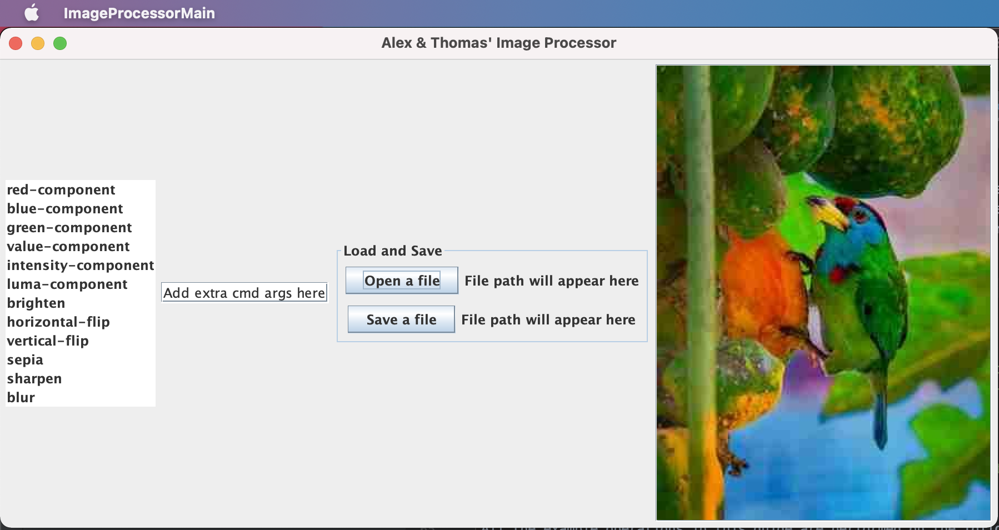

#### GUI with sharpened image
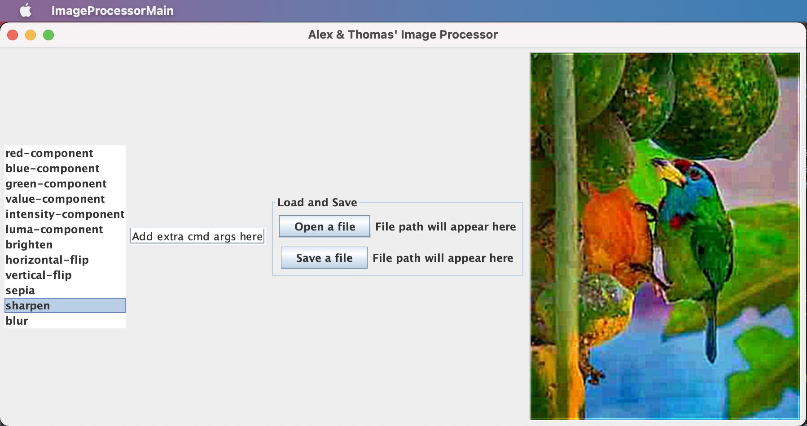

# Runtime CLI Commands

> Note that due to the way our program is written, one should be able to use all commands without
> using `load` or `save` to operate through the application state -- every command
> could directly operate on files.
>
> However, if your intention is to use `load` and `save`, you must first `load` the file into
> the memory under a specific alias before you could perform operations on that alias and/or
> save it in the filesystem.

All the example operations in this guide are performed on the following original picture:

## File operations

### Load file

**Syntax:** `load [image-path] [image-name]`
(`image-path` is source, `image-name` is target alias name to solve in the system)

**Description:** attempts to load the file from the provided path and cache it to the application's
memory state. Note that this can also be used to "clone" a file -- if both of the arguments are
valid file paths, the command will load the image from the first file path to the second file path.
This could also be used to convert between different extension types.

### Save file

**Syntax:** `save [image-path] [image-name]`

**Description:** attempts to save the file from the cache and save it to the supplied file path.
Note that this can also be used to "clone" a file -- if both of the arguments are valid file paths,
the command will load the image from the first file path to the second file path. This could also be
used to convert between different extension types.

## Color transformations

### Blue component grayscale

**Syntax:** `blue-component [image-name] [dest-image-name]`

**Description:** applies the blue-channel-based grayscale on the given image and attempts to save it
at the `dest-image-name`. The blue-component grayscale sets all the channels of a given pixel to the
value in the blue channel. Essentially, the blue-component-grayscale will display the intensity of
the blue color in a given image.

**Example:**

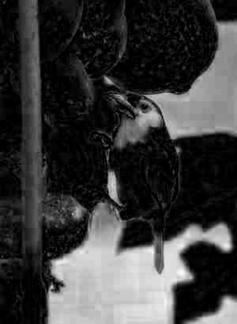

### Brighten/darken

**Syntax:** `brighten [image-name] [increment] [dest-image-name]`

**Description:** brightens or darkens the given image and then adds it to local memory and/or the
file system. The brighten command simply adds some value (could be both positive and negative) to
every channel in every pixel in the image. Positive increment means brightening, negative increment
means darkening.

**Example of brightened by 10:**

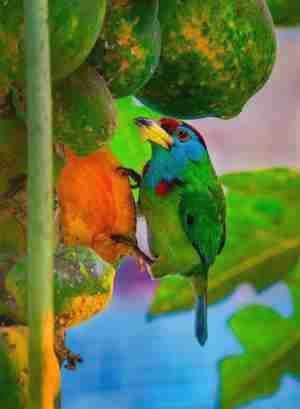

**Example of darkened by 20:**

### Green component grayscale

**Syntax:** `green-component [image-name] [dest-image-name]`

**Description:** applies the green-channel-based grayscale on the given image and attempts to save
it at the `dest-image-name`. The green-component grayscale sets all the channels of a given pixel to
the value in the green channel. Essentially, the green-component-grayscale will display the
intensity of the green color in a given image.

**Example:**

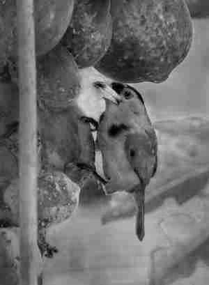

### Intensity component grayscale

**Syntax:** `intensity-component [image-name] [dest-image-name]`

**Description:** applies the intensity-based grayscale on the given image and attempts to save it at
the `dest-image-name`. The intensity grayscale sets all the channels of a given pixel to the
average (mean) value of all the channels in the pixel. This is essentially a way to display the
overall intensity of the image.

**Example:**

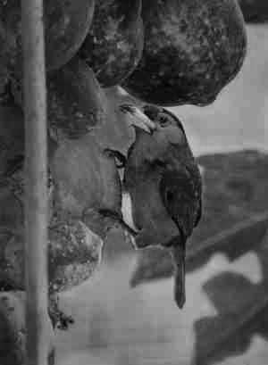

### Luma component grayscale

**Syntax:** `luma-component [image-name] [dest-image-name]`

**Description:** applies the luma-based grayscale on the given image and attempts to save it at
the `dest-image-name`. The luma grayscale sets all the channels of a given pixel to the sum 0.2126r

+ 0.7152g + 0.0722b, where r,g,b are the appropriate color channel values of a pixel. This is
  essentially a way to display the overall intensity of the image.

**Example:**

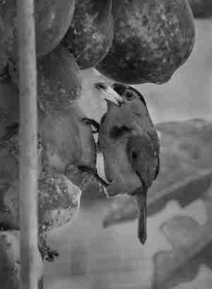

### Red component grayscale

**Syntax:** `red-component [image-name] [dest-image-name]`

**Description:** applies the red-channel-based grayscale on the given image and attempts to save it
at the `dest-image-name`. The red-component grayscale sets all the channels of a given pixel to the
value in the red channel. Essentially, the red-component-grayscale will display the intensity of the
red color in a given image.

**Example:**

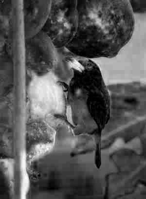

### Sepia

**Syntax:** `sepia [image-name] [dest-image-name]`

**Description:** applies the sepia filter on the given image and attempts to load it into the local
memory and/or file system. The sepia filter is defined per this
article: https://www.wikiwand.com/en/Sepia_(color).

**Example:**

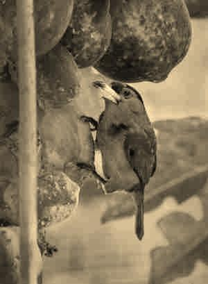

### Value component grayscale

**Syntax:** `value-component [image-name] [dest-image-name]`

**Description:** applies the value-based grayscale on the given image and attempts to save it at
the `dest-image-name`. The value grayscale sets all the channels of a given pixel to the maximum
value of all the channels in the pixel. This is essentially a way to display the overall intensity
of the image.

**Example:**

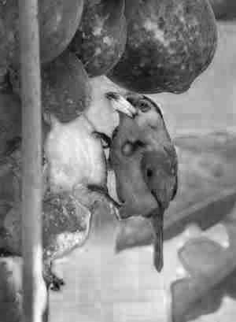

## Kernel-based filter transformations

### Blur

**Syntax:** `blur [image-name] [dest-image-name]`

**Description:** blurs the given image and attempts to load the new version into the memory and/or
the file system. Blurring is a kernel-based process, read more about it
here: https://www.wikiwand.com/en/Gaussian_blur.

**Example:**

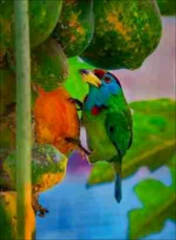

**Really blurry example:**

### Sharpen

**Syntax:** `sharpen [image-name] [dest-image-name]`

**Description:** sharpens the given image and attempts to load the new version into the memory
and/or the file system. Sharpening is a kernel-based process, read more about it
here: https://en.wikipedia.org/wiki/Unsharp_masking.

**Example:**

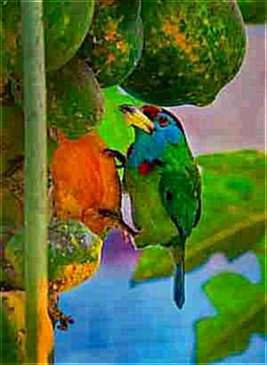

**Really sharp example:**

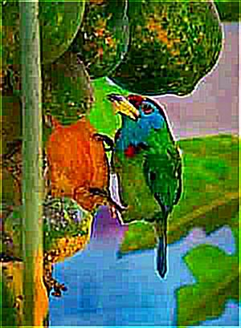

## Geometrical transformations

### Horizontal flip

**Syntax:** `horizontal-flip [image-name] [dest-image-name]`

**Description:** flips ("reflects") the given image horizontally (against the vertical axis).

**Example:**

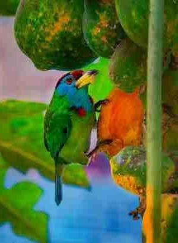

### Vertical flip

**Syntax:** `vertical-flip [image-name] [dest-image-name]`

**Description:** flips ("reflects") the given image vertically (against the horizontal axis).

**Example:**

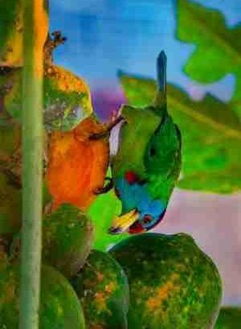